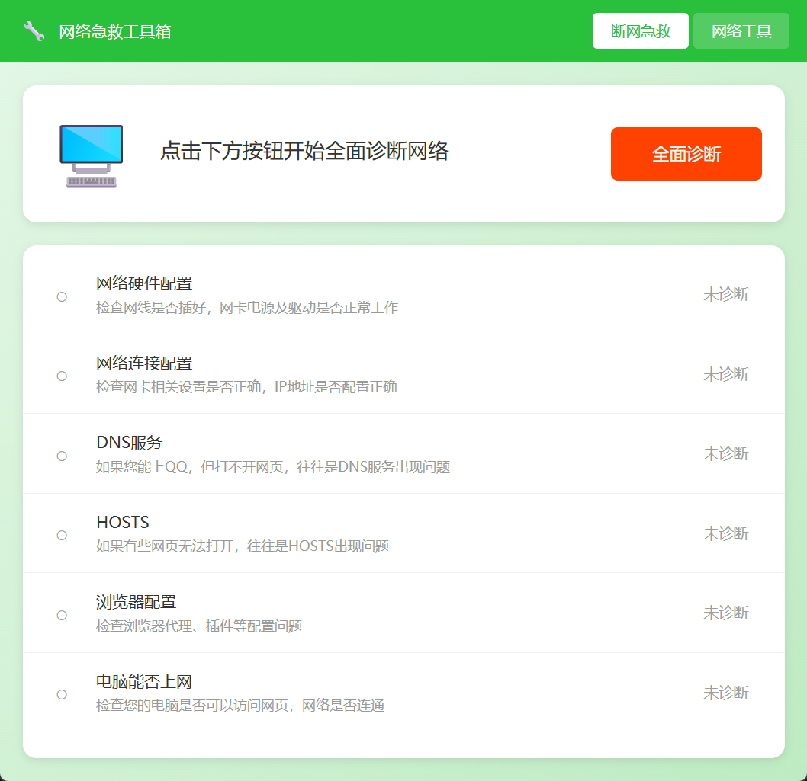

# 网络急救工具箱

一个独立的 Windows 网络诊断与修复工具，功能对标 360 断网急救箱，但完全独立运行、无任何依赖。

## 下载

**[点击下载最新版本](https://github.com/ccx0058/network-rescue-toolkit/releases/latest/download/NetworkRescue.exe)**

或前往 [Releases 页面](https://github.com/ccx0058/network-rescue-toolkit/releases) 下载历史版本。

> 注意：程序需要管理员权限运行，首次启动会弹出 UAC 提示，请点击"是"。

## 功能特性

### 断网急救（一键诊断修复）
- 网络适配器检测 - 检测网卡状态、驱动是否正常
- IP 配置检测 - 检查 IP 地址、DHCP 配置
- DNS 服务检测 - 测试 DNS 解析功能和响应时间
- HOSTS 文件检测 - 检查是否有可疑的域名劫持
- 代理设置检测 - 检查系统代理配置
- 网络连通性检测 - 多目标测试互联网连接状态

### 网络工具箱
- Ping 测试 - 支持域名/IP/URL 自动解析
- 一键切换 DNS - 支持10个国内外DNS服务商
- 刷新 DNS 缓存 - 清除本地 DNS 缓存
- 重置网络组件 - 重置 Winsock 和 TCP/IP 协议栈
- 释放/续约 IP - 重新获取 DHCP 分配的 IP
- 路由追踪 - Tracert 查看数据包路由路径
- 端口检测 - 检测指定主机端口是否开放
- 网卡详细信息 - 查看 IP、MAC、网关、DNS 等配置
- 重启网络服务 - 重启 DHCP、DNS 缓存等系统服务
- 防火墙状态 - 查看 Windows 防火墙状态

### 支持的 DNS 服务商
| 服务商 | 主 DNS | 备用 DNS |
|--------|--------|----------|
| 114 DNS | 114.114.114.114 | 114.114.115.115 |
| 阿里 DNS | 223.5.5.5 | 223.6.6.6 |
| 腾讯 DNS | 119.29.29.29 | 182.254.118.118 |
| 百度 DNS | 180.76.76.76 | - |
| 360 DNS | 101.226.4.6 | 218.30.118.6 |
| CNNIC DNS | 1.2.4.8 | 210.2.4.8 |
| OneDNS | 117.50.10.10 | 52.80.52.52 |
| DNSPod | 119.28.28.28 | 119.29.29.29 |
| Google DNS | 8.8.8.8 | 8.8.4.4 |
| Cloudflare | 1.1.1.1 | 1.0.0.1 |

## 截图

### 断网急救


### 网络工具


## 技术栈

- 后端: Go 1.21+
- GUI 框架: Wails v2
- 前端: Vue 3 + TypeScript

## 自行构建

### 前置要求
- Go 1.21+
- Node.js 18+
- Wails CLI v2

### 安装 Wails
```bash
go install github.com/wailsapp/wails/v2/cmd/wails@latest
```

### 构建
```bash
wails build
```

构建完成后，可执行文件位于 `build/bin/`

## 使用说明

1. 双击运行程序（会自动请求管理员权限）
2. **断网急救**：点击"全面诊断"检测网络状态，发现问题点击"立即修复"
3. **网络工具**：切换到工具页面使用各种网络工具

## 项目结构

```
network-rescue-toolkit/
├── main.go                 # 程序入口（含管理员权限提升）
├── app.go                  # Wails 应用绑定 + 网络工具 API
├── internal/
│   ├── diagnostic/         # 6个诊断模块
│   └── repair/             # 7个修复模块
├── pkg/
│   ├── types/              # 类型定义
│   ├── executor/           # 命令执行器
│   ├── registry/           # 注册表操作
│   ├── privilege/          # 权限管理
│   ├── backup/             # 备份管理
│   └── report/             # 报告生成
└── frontend/               # Vue 3 前端
```

## 许可证

MIT License
